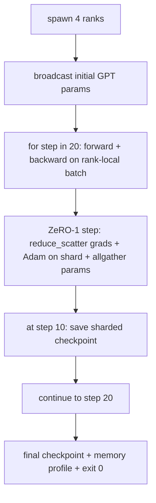

# End-to-End Distributed Training

> Lessons 76 through 80 each built one piece. This is the assembly: a tiny GPT trained across 4 simulated ranks with DDP for gradient sync, ZeRO-1 for optimiser-state sharding, and a sharded checkpoint at the halfway mark and at the end. The demo runs 20 steps, self-terminates, prints a loss curve plus a memory profile, and writes a resumable checkpoint.

**Type:** Build
**Languages:** Python
**Prerequisites:** Phase 19 Track C lessons 42-49
**Time:** ~90 min

## Learning Objectives

- Compose DDP (lesson 77) plus ZeRO-1 (lesson 78) plus sharded checkpoints (lesson 80) into one training loop.
- Train a 4-layer transformer language model on a small synthetic corpus for 20 steps across 4 simulated ranks.
- Print a per-step loss table, a per-rank memory profile, and a checkpoint manifest that resumes byte-equal on the same world size.
- Defend the composition: each piece is independently testable in earlier lessons and this lesson proves they compose.

## The Problem

A capstone is the proof that the pieces fit together. Lesson 76 implemented collectives. Lesson 77 wrapped them into DDP. Lesson 78 sharded optimiser state with reduce_scatter. Lesson 79 analysed pipeline. Lesson 80 saved a sharded checkpoint. Each lesson stood alone with its own test. A real training run uses every primitive at once; if the composition is wrong, the loss diverges, the checkpoint refuses to resume, or the per-rank memory grows when it should shrink.

This lesson runs the end-to-end demo and verifies four invariants: (a) the loss decreases monotonically across the 20 steps within float noise, (b) every rank holds the same parameter norm at every step, (c) the per-rank optimiser memory equals the ZeRO-1 formula 12P/N bytes, and (d) the checkpoint at step 10 reloads byte-equal at restart. The demo self-terminates: 20 steps, single command, exit 0.

## The Concept



### The mini GPT

The model is small on purpose: 4 transformer blocks, hidden dim 64, 4 attention heads, vocab 256, sequence length 32. About 80K parameters. Big enough to expose every wiring decision (rotary embeddings would still attach; multi-head attention runs the standard masked path; LayerNorm has weights to sync). Small enough that 20 steps on 4 CPU ranks finish in under a minute.

### The composition rules

| Lesson piece | What it owns | What it leaves to the loop |
|--------------|--------------|----------------------------|
| DDP broadcast | Initial parameter sync | One call at construct time |
| ZeRO-1 step | Gradient sync, master copy update, parameter broadcast | One call per step replacing optimiser.step |
| Sharded checkpoint | Persist per-rank state, manifest with sha256 | Called on rank 0 with state collected via allgather |
| Training loop | Forward, backward, loss logging | Calls the three above in order |

The loop does not know about reduce_scatter or rendezvous files. The ZeRO and checkpoint modules expose narrow interfaces that the loop composes.

### Why a tiny GPT and not just an MLP

The MLP from lesson 77 was sufficient to verify gradient sync. A tiny GPT adds three things: shared weights across layers (no, but the embedding does tie to lm_head in real GPT), softmax+cross-entropy as the loss (more numerical edge cases than MSE), and an asymmetric forward (embeddings then attention then MLP per layer). Sticking with an MLP for the capstone would hide whether the composition handles LayerNorm running stats or the embedding layer's grad shape correctly.

### Self-terminating means exit 0

The loop runs a fixed 20 steps and exits. No `while True`, no human intervention, no resume from external state. A capstone you can leave running unattended and find a complete log when it finishes is a capstone that proves the system is wired correctly. If any piece deadlocks the demo never returns and the test rig catches it.

## Build It

`code/main.py` implements:

- `MiniGPT`: 4-layer transformer with masked self-attention and a tied embedding+head, ~80K params.
- `make_synthetic_corpus(seed, vocab, n_total, seq_len)`: deterministic next-token-prediction data.
- `_train_worker`: spawned per rank; broadcasts init params, runs the loop, calls ZeRO step, writes checkpoint at step 10.
- `verify_resume`: after the main run, spawns a fresh 4-rank worker pool that loads the step-10 checkpoint and asserts byte-equal parameter shards.
- `main`: orchestrates the whole demo, prints the loss table, the memory profile, and the verification result.

Run it:

```
python3 code/main.py
```

Output: a 20-row loss table, a 4-row per-rank memory profile, a checkpoint manifest, and a "RESUME VERIFIED" line on success.

## Production patterns in the wild

Three patterns finish the composition for real runs.

**Checkpoint every K minutes, not every K steps.** Step time varies with seq length and microbatch count. A 10-minute checkpoint cadence catches the same compute regardless of model size. The lesson uses step-based for simplicity; production uses wall-clock-based.

**Detect divergence early.** Production runs add a NaN guard after backward and a loss-spike detector; if loss jumps by more than 2x in one step, roll back to the previous checkpoint instead of letting the optimiser march into a degenerate state. The lesson's loss curve is smooth so the guard is unused but the hook stays.

**Aggregate the memory profile across ranks.** Per-rank memory differs by rank in real runs (rank with the largest pipeline stage holds more activations). Production logs the max across ranks plus the mean; the lesson prints per-rank to show the formula matches.

## Use It

Production patterns:

- **DeepSpeed.** Combines DDP + ZeRO + pipeline + activation checkpointing under one config. The lesson's composition is the DeepSpeed shape in miniature.
- **PyTorch FSDP.** The native equivalent. `FullyShardedDataParallel` with `ShardingStrategy.SHARD_GRAD_OP` is ZeRO-2.
- **NeMo and Megatron-LM.** Add tensor parallel for the very largest models; otherwise the composition is the same shape.

## Ship It

The full track ends here. The 6 lessons together are the distributed-training subsystem a real team would build before adopting DeepSpeed; the abstraction has been proven against gloo and the failure modes have been exercised. Phase 17 (infrastructure and production) is the place to take this to a real cluster.

## Exercises

1. Add a tensor-parallel split of the attention head and verify the loss matches the single-rank baseline. Two ranks: half the heads per rank, allreduce of the attention output.
2. Add gradient accumulation across 4 microbatches and prove the gradient equals the gradient of one big batch.
3. Add a resume-from-step-10 path that actually continues training to step 20 and produces the same final loss as the original run.
4. Add a metrics export (loss, grad norm, step time) to JSONL so the run can be visualised after the fact.
5. Add a NaN guard that rolls back to the previous checkpoint on a loss spike, and force a spike with a one-step LR multiplier to exercise the rollback.

## Key Terms

| Term | What people say | What it actually means |
|------|----------------|------------------------|
| End-to-end | "Wire it all up" | One run composes every piece, not a unit test per piece |
| Memory profile | "GB per rank" | Bytes held on each rank for params, grads, optimiser state |
| Resume contract | "Save and load" | Per-rank state byte-equal after a checkpoint round-trip |
| Self-terminating | "Bounded run" | Fixed step count, exit 0 on completion, no human in the loop |

## Further Reading

- [DeepSpeed end-to-end training tutorial](https://www.deepspeed.ai/getting-started/)
- [PyTorch FSDP advanced tutorial](https://pytorch.org/tutorials/intermediate/FSDP_advanced_tutorial.html)
- [Megatron-LM training script reference](https://github.com/NVIDIA/Megatron-LM)
- Phase 19 Lessons 76-80 — each piece this lesson composes
- Phase 17 — moving the composition to a real cluster
